<div align="center">

# 🚀 Patch Pilot -  AI Code Analysis Platform

### * NOW SUPPORTS FULL REPOSITORY ANALYSIS! 🔥*

<p align="center">
  
  
  
  
  
</p>

<p align="center">
  
  
  
  
  
  
</p>

<h3>
  <a href="#-quick-start">Quick Start</a>
  <span> · </span>
  <a href="#-features">Features</a>
  <span> · </span>
  <a href="#-documentation">Docs</a>
  <span> · </span>
  <a href="#-demo">Demo</a>
</h3>

<p align="center">
  <i><b>🆕 Analyze ENTIRE REPOSITORIES or Pull Requests!</b><br/>
  Detect security vulnerabilities, performance bottlenecks, architecture issues, and code quality problems.<br/>
  Get AI-powered insights with our advanced ML-inspired pattern detection engine.</i>
</p>


</div>

---

## 📋 Table of Contents

1. [Why Patch Pilot?](#-why-patch-pilot-v20)
2. [Features](#-features)
3. [Prerequisites](#-prerequisites)
4. [Quick Start with Docker](#-quick-start-with-docker-recommended)
5. [Manual Setup](#-manual-setup-development)
6. [Usage Guide](#-usage-guide)
7. [Configuration](#-configuration)
8. [Troubleshooting](#-troubleshooting)
9. [Architecture](#-architecture)
10. [Contributing](#-contributing)

---

## 🔮 Why Patch Pilot v2.0?

<table>
<tr>
<td width="25%" valign="top">

### 🎯 Repository & PR Analysis
Analyze **entire repositories** or **pull requests**. Just paste any GitHub URL and get instant insights!

</td>
<td width="25%" valign="top">

### 🧠 Advanced AI Engine
Super-powered analysis with **AI insights**, **architecture patterns**, and **cognitive complexity** detection.

</td>
<td width="25%" valign="top">

### 📊 AI Insights Dashboard
Beautiful **real-time dashboard** with code health metrics, trends, and AI recommendations.

</td>
<td width="25%" valign="top">

### ⚡ Lightning Fast
Optimized for speed with **parallel analysis**, smart caching, and incremental scanning.

</td>
</tr>
</table>

## ✨ New Features in v2.0

### 🎉 **MAJOR UPDATE**: Full Repository Analysis
- 🆕 **Analyze entire GitHub repositories** - not just PRs!
- 🆕 **Smart URL detection** - automatically detects repository vs PR URLs
- 🆕 **Recent analysis history** - quickly re-analyze previous repos

### 🧠 **AI-Powered Insights Dashboard**
- 📊 **Code Health Metrics** - Real-time visualization of code quality
- 📈 **Trend Analysis** - Track quality improvements over time
- 🎯 **Smart Recommendations** - AI-prioritized action items
- 🔥 **Language Distribution** - See your tech stack at a glance

### 🚀 **Enhanced Analysis Engine**

<details open>
<summary><b>🔒 Security Analysis (30+ patterns)</b></summary>

- ✅ Hardcoded secrets & API keys detection
- ✅ SQL injection vulnerabilities
- ✅ XSS (Cross-Site Scripting) risks
- ✅ Command injection detection
- ✅ Path traversal vulnerabilities
- ✅ XXE (XML External Entity) attacks
- ✅ Weak cryptography usage
- ✅ Insecure random number generation
- ✅ SSRF vulnerabilities
- ✅ Open redirect detection

</details>

<details>
<summary><b>⚡ Performance Analysis</b></summary>

- 🎯 N+1 query detection
- 🎯 Memory leak identification
- 🎯 Inefficient loop patterns
- 🎯 Synchronous I/O in async contexts
- 🎯 Unbounded cache growth
- 🎯 Blocking operations detection

</details>

<details>
<summary><b>🏗️ Architecture Analysis (NEW!)</b></summary>

- 🏛️ Tight coupling detection
- 🏛️ Missing dependency injection patterns
- 🏛️ Circular dependency risks
- 🏛️ God class anti-patterns
- 🏛️ Long method detection
- 🏛️ Deep nesting analysis

</details>

<details>
<summary><b>🤖 AI Insights (NEW!)</b></summary>

- 🧠 Memory optimization opportunities
- 🧠 Missing data validation
- 🧠 Async/await pattern suggestions
- 🧠 Resource cleanup detection
- 🧠 Context-aware code improvements
- 🧠 Cognitive complexity analysis

</details>

<details>
<summary><b>📊 Code Quality Metrics</b></summary>

- 📈 Cyclomatic complexity calculation
- 📈 Cognitive complexity scoring
- 📈 Code duplication detection
- 📈 Magic number identification
- 📈 TODO/FIXME tracking
- 📈 Best practices compliance
- � Automatic PR polling
- 📉 Code quality trends
- 🎯 Issue tracking and resolution
- 📱 Webhook integration

</details>

<details>
<summary><b>🔒 Enterprise Security</b></summary>
<br/>

- � JWT-based authentication
- 🔑 HMAC webhook verification
- 🛡️ Role-based access control (RBAC)
- 🔒 Secure credential storage
- 📜 Audit logging

</details> 

## 🏗️ Architecture

```mermaid
graph TB
    A[👤 User Browser] -->|HTTP/3000| B[⚡ Nginx Proxy]
    B -->|Proxy /api/*| C[🚀 Spring Boot Backend]
    C -->|JDBC| D[(🐘 PostgreSQL)]
    C -->|REST API| E[🐙 GitHub API]
    C -->|Clone & Analyze| F[💾 Workspace]
    B -->|Static Files| G[⚛️ React Frontend]
    
    style A fill:#61DAFB,stroke:#333,stroke-width:2px
    style B fill:#009639,stroke:#333,stroke-width:2px
    style C fill:#6DB33F,stroke:#333,stroke-width:2px
    style D fill:#316192,stroke:#333,stroke-width:2px
    style E fill:#181717,stroke:#333,stroke-width:2px
    style F fill:#FFD700,stroke:#333,stroke-width:2px
    style G fill:#61DAFB,stroke:#333,stroke-width:2px
```



<div align="center">

### 🛠️ Tech Stack

</div>

<table>
<tr>
<td valign="top" width="50%">

#### 🎨 **Frontend**

| Technology | Purpose |
|------------|---------|
|  | UI Framework |
|  | Type Safety |
|  | Build Tool |
|  | Styling |

</td>
<td valign="top" width="50%">

#### ⚙️ **Backend**

| Technology | Purpose |
|------------|---------|
|  | Framework |
|  | Language |
|  | Database |
|  | Deployment |

</td>
</tr>
</table>

<div align="center">

### 📦 Database Support

| Database | Status | Use Case |
|----------|--------|----------|
| PostgreSQL | ✅ **Recommended** | Production & Large teams |
| MySQL | ✅ Supported | Alternative production DB |
| SQLite | ✅ Supported | Small teams & testing |
| H2 | ✅ Supported | Development & testing |

</div>

## 🚀 Quick Start

<div align="center">

### 🐳 One-Command Setup (Docker - Recommended)

```bash
docker-compose up --build
```

**That's it!** 🎉 Open http://localhost:3000 in your browser.

</div>

## 🎨 Usage Examples

### 🆕 Analyze a Full Repository

1. Go to the **Analysis** page
2. Enter a repository URL:
   ```
   https://github.com/AM4517UMOR4NG/Patch_Pilot
   ```
3. Click **Start Deep Analysis**
4. Watch real-time analysis progress
5. View results in the AI Insights Dashboard!

### 🔄 Analyze a Pull Request

1. Go to the **Analysis** page  
2. Enter a PR URL:
   ```
   https://github.com/owner/repo/pull/123
   ```
3. Click **Start Deep Analysis**
4. Get instant feedback on PR quality

### 📊 View AI Insights Dashboard

1. Complete any analysis
2. Click **AI Insights** in the navigation
3. Explore:
   - 📈 Code Health Metrics
   - 🧠 AI Recommendations
   - 📉 Quality Trends
   - 🎯 Architecture Issues

---

### 📋 Prerequisites

<table>
<tr>
<td>

**For Docker Setup** ✅ *Easiest*
- Docker Desktop 20.10+
- 4GB RAM minimum
- 10GB free disk space

</td>
<td>

**For Manual Setup** 🛠️ *Advanced*
- Java 17+ (OpenJDK recommended)
- Node.js 18+ & npm 9+
- PostgreSQL 15+ (or MySQL/SQLite)
- Git

</td>
</tr>
</table>

---

### 🐳 Docker Installation (Recommended)

```bash
# 1️⃣ Clone the repository
git clone https://github.com/AM4517UMOR4NG/Patch-Pilot.git
cd Patch-Pilot

# 2️⃣ Create .env file (optional)
cat > .env << EOF
GITHUB_TOKEN=your_github_token_here
OPENAI_API_KEY=your_openai_key_here
EOF

# 3️⃣ Start all services
docker-compose up --build -d

# 4️⃣ Check status
docker-compose ps

# 5️⃣ View logs
docker-compose logs -f
```

<details>
<summary>📊 <b>Docker Services Overview</b></summary>

```bash
SERVICE      PORT     STATUS
────────────────────────────────────
frontend     3000     ✅ Running
backend      8080     ✅ Running
database     5432     ✅ Running
```

</details>

<details>
<summary>🔧 <b>Docker Management Commands</b></summary>

```bash
# Stop services
docker-compose down

# Restart services
docker-compose restart

# View logs
docker-compose logs backend
docker-compose logs frontend

# Clean up (removes volumes)
docker-compose down -v

# Rebuild specific service
docker-compose up --build backend
```

</details>

---

### 💻 Manual Installation (Alternative)

<details>
<summary>Click to expand manual installation steps</summary>

#### 1️⃣ Clone Repository
```bash
git clone https://github.com/AM4517UMOR4NG/Patch-Pilot.git
cd Patch-Pilot
```

#### 2️⃣ Setup Database

<details>
<summary><b>PostgreSQL Setup</b> (Recommended)</summary>

```sql
CREATE DATABASE aicodereview;
CREATE USER postgres WITH PASSWORD 'postgres';
GRANT ALL PRIVILEGES ON DATABASE aicodereview TO postgres;
```

```bash
# Update backend/src/main/resources/application.yml
spring:
  datasource:
    url: jdbc:postgresql://localhost:5432/aicodereview
    username: postgres
    password: postgres
```

</details>

<details>
<summary><b>MySQL Setup</b></summary>

```sql
CREATE DATABASE aicodereview;
CREATE USER 'aiuser'@'localhost' IDENTIFIED BY 'aipassword';
GRANT ALL PRIVILEGES ON aicodereview.* TO 'aiuser'@'localhost';
```

</details>

#### 3️⃣ Start Backend
```bash
cd backend
mvn clean install
mvn spring-boot:run "-Dspring-boot.run.profiles=local"
```

#### 4️⃣ Start Frontend
```bash
cd frontend
npm install
npm run dev
```

#### 5️⃣ Access Application
| Service | URL |
|---------|-----|
| 🌐 Frontend | http://localhost:3000 |
| 🔧 Backend API | http://localhost:8080 |
| 📚 API Docs | http://localhost:8080/swagger-ui.html |

</details>

---

### ✅ Verification

Test if everything is working:

```bash
# Test backend health
curl http://localhost:8080/actuator/health

# Expected: {"status":"UP"}

# Test frontend
curl http://localhost:3000

# Expected: HTML content
```

---

### 🎯 First Steps

1. **Open Frontend**: Navigate to http://localhost:3000
2. **Paste PR URL**: Enter a GitHub PR URL like:
   ```
   https://github.com/facebook/react/pull/27000
   ```
3. **Click Analyze**: Wait ~30 seconds for analysis
4. **View Results**: See files, findings, and recommendations!

<div align="center">

**Need help?** Check out [📚 Full Documentation](#-documentation) or [❓ Troubleshooting](#-troubleshooting)

</div>

## 🔧 Configuration

### Database Setup

#### PostgreSQL Setup
1. Create database and user:
```sql
CREATE DATABASE patchpilot;
CREATE USER patchpilot WITH PASSWORD 'your-password';
GRANT ALL PRIVILEGES ON DATABASE patchpilot TO patchpilot;
```

2. Run the initialization script:
```bash
psql -U postgres -d patchpilot -f postgres-setup.sql
```

#### MySQL Setup
1. Create database and user:
```sql
CREATE DATABASE patchpilot;
CREATE USER 'patchpilot'@'localhost' IDENTIFIED BY 'your-password';
GRANT ALL PRIVILEGES ON patchpilot.* TO 'patchpilot'@'localhost';
FLUSH PRIVILEGES;
```

2. Run the initialization script:
```bash
mysql -u root -p patchpilot < mysql-setup.sql
```

#### SQLite Setup
The SQLite database will be automatically created at `./data/patchpilot.db` when using the SQLite profile.

#### H2 Setup
For H2, you can use the H2 Console at http://localhost:8080/h2-console with:
- JDBC URL: `jdbc:h2:mem:testdb` (in-memory) or `jdbc:h2:file:./data/patchpilot` (file)
- Username: `sa`
- Password: (empty)

### Environment Variables

#### Backend
```env
# Database (PostgreSQL)
DATABASE_URL=jdbc:postgresql://localhost:5432/patchpilot
DATABASE_USER=postgres
DATABASE_PASSWORD=your-password

# Database (MySQL)
DATABASE_URL=jdbc:mysql://localhost:3306/patchpilot
DATABASE_USER=patchpilot
DATABASE_PASSWORD=your-password

# Security
JWT_SECRET=your-jwt-secret-key
JWT_EXPIRATION_SECONDS=86400
GITHUB_WEBHOOK_SECRET=your-webhook-secret

# CORS
APP_CORS_ALLOWED_ORIGINS=http://localhost:5173
```

#### Frontend
```env
VITE_API_BASE_URL=http://localhost:8080/api
```

## 📚 Documentation

<div align="center">

| 📖 Document | Description |
|-------------|-------------|
| [API Documentation](API_DOCUMENTATION.md) | Complete REST API reference with examples |
| [System Architecture](CARA_KERJA_SISTEM.md) | Detailed system flow (Bahasa Indonesia) |
| [API Quick Reference](API_QUICK_REFERENCE.md) | Quick API endpoint cheat sheet |
| [Setup Guide](SETUP_GUIDE.md) | Advanced configuration guide |

</div>

---

## 🎮 Demo

<div align="center">

### 🎬 See It In Action

<table>
<tr>
<td align="center" width="50%">

**🔍 Code Analysis**


Real-time analysis of pull requests with severity indicators

</td>
<td align="center" width="50%">

**📊 Dashboard View**


Beautiful dashboard showing findings and metrics

</td>
</tr>
<tr>
<td align="center" width="50%">

**🐛 Finding Details**


Detailed view of security issues and bugs

</td>
<td align="center" width="50%">

**✨ AI Suggestions**


AI-powered fix suggestions with explanations

</td>
</tr>
</table>

</div>

---

## 🎯 Usage Guide

### Step 1️⃣: Analyze a Pull Request

```bash
# Open frontend
http://localhost:3000

# Paste GitHub PR URL
https://github.com/facebook/react/pull/27000

# Click "Analyze PR" button
```

### Step 2️⃣: View Results

The system will show:
- ✅ **Files Changed**: All modified files in the PR
- 🐛 **Findings**: Detected issues with severity levels
- 💡 **Recommendations**: AI-generated fix suggestions
- 📊 **Metrics**: Code quality statistics

### Step 3️⃣: Review Findings

Each finding includes:
- **Severity**: HIGH, MEDIUM, or LOW
- **Category**: SECURITY, BUG, CODE_SMELL, etc.
- **Location**: File path and line numbers
- **Description**: What's wrong
- **Suggestion**: How to fix it

### Step 4️⃣: Apply Fixes (Optional)

```bash
# Download suggested patch
# Apply manually or use git apply

# Or copy the suggested code directly
```

---

## 🔌 API Examples

### Analyze Pull Request

```bash
curl -X POST http://localhost:8080/api/github/sync/facebook/react/pr/27000
```

### Get Analysis Results

```bash
# Get repositories
curl http://localhost:8080/api/repos

# Get pull requests
curl http://localhost:8080/api/pullrequests/repo/1

# Get analysis runs
curl http://localhost:8080/api/runs/pull-request/1
```

<details>
<summary>📝 <b>See More API Examples</b></summary>

```bash
# Health check
curl http://localhost:8080/actuator/health

# Sync entire repository
curl -X POST http://localhost:8080/api/github/sync/facebook/react

# Get specific run
curl http://localhost:8080/api/runs/1

# Start polling
curl -X POST http://localhost:8080/api/github/polling/start

# Get polling status
curl http://localhost:8080/api/github/polling/status
```

Full API documentation: http://localhost:8080/swagger-ui.html

</details>

## ❓ Troubleshooting

<details>
<summary>🔴 <b>Backend Health is DOWN</b></summary>

```bash
# Check backend logs
docker-compose logs backend --tail 50

# Check database connection
docker exec patch_pilot-db-1 psql -U postgres -d aicodereview -c "SELECT 1;"

# Restart backend
docker-compose restart backend
```

</details>

<details>
<summary>⚠️ <b>404 Error on API Calls</b></summary>

```bash
# Verify nginx proxy config
docker exec patch_pilot-frontend-1 cat /etc/nginx/nginx.conf

# Test backend directly
curl http://localhost:8080/api/actuator/health

# Test via nginx
curl http://localhost:3000/api/actuator/health
```

</details>

<details>
<summary>🐙 <b>GitHub API 404 - Repository Not Found</b></summary>

The repository might be:
- **Private**: Set `GITHUB_TOKEN` environment variable
- **Wrong name**: Verify exact owner/repo spelling (case-sensitive!)
- **Deleted**: Repository no longer exists

```bash
# Test if repo exists
curl https://api.github.com/repos/owner/repo

# For private repos, set token
echo "GITHUB_TOKEN=your_token_here" >> .env
docker-compose up --build
```

</details>

<details>
<summary>⏳ <b>Analysis Stuck in PENDING</b></summary>

```bash
# Check runner service logs
docker-compose logs backend | grep -i "runner\|analysis"

# Check workspace directory
docker exec patch_pilot-backend-1 ls -la /tmp/patch-pilot-workspace

# Restart backend
docker-compose restart backend
```

</details>

<details>
<summary>🔑 <b>Rate Limit Exceeded</b></summary>

GitHub API has rate limits:
- **Without token**: 60 requests/hour
- **With token**: 5000 requests/hour

**Solution**: Add GitHub token to `.env`:
```bash
GITHUB_TOKEN=ghp_your_token_here
```

Check your rate limit:
```bash
curl https://api.github.com/rate_limit
```

</details>

---

## 🌐 Environment Variables

<details>
<summary>📝 <b>Complete Environment Configuration</b></summary>

### Backend Variables

```env
# Database Configuration
DATABASE_URL=jdbc:postgresql://db:5432/aicodereview
DATABASE_USER=postgres
DATABASE_PASSWORD=postgres

# GitHub Integration (Required for private repos)
GITHUB_TOKEN=ghp_your_github_personal_access_token

# AI Analysis (Optional)
OPENAI_API_KEY=sk-your_openai_api_key

# Spring Profile
SPRING_PROFILES_ACTIVE=local

# CORS Configuration
APP_CORS_ALLOWED_ORIGINS=http://localhost:3000

# Workspace Directory
WORKSPACE_DIR=/tmp/patch-pilot-workspace

# Polling Configuration
POLLING_ENABLED=false
POLLING_INTERVAL_MINUTES=30

# Analysis Configuration
ANALYSIS_MAX_FILES=50
ANALYSIS_FILE_EXTENSIONS=.java,.js,.ts,.jsx,.tsx,.py,.go
```

### Frontend Variables

```env
# API Base URL
VITE_API_BASE_URL=/api
```

</details>

## 🛡️ Security

### Best Practices

1. **Webhook Verification**
   - All GitHub webhooks are verified using HMAC SHA-256
   - Signature validation prevents unauthorized webhook calls

2. **Authentication & Authorization**
   - JWT-based authentication with configurable expiration
   - Role-based access control (RBAC)
   - Secure password hashing with BCrypt

3. **Environment Security**
   - Never commit secrets to version control
   - Use environment variables for sensitive configuration
   - Rotate secrets regularly

4. **Code Execution** (⚠️ Important)
   - Code analysis must run in isolated containers
   - Apply resource limits and network isolation
   - Never execute untrusted code on the host system

## 📁 Project Structure

```
Patch-Pilot/
├── backend/                  # Spring Boot backend
│   ├── src/
│   │   ├── main/
│   │   │   ├── java/       # Java source code
│   │   │   └── resources/  # Configuration files
│   │   └── test/           # Test files
│   ├── target/             # Compiled JAR
│   └── pom.xml             # Maven configuration
├── frontend/               # React frontend
│   ├── src/
│   │   ├── components/     # Reusable components
│   │   ├── pages/         # Page components
│   │   ├── hooks/         # Custom React hooks
│   │   ├── api/           # API client
│   │   └── utils/         # Utility functions
│   ├── dist/              # Production build
│   └── package.json       # Node dependencies
├── docs/                  # Documentation
│   └── examples/         # Sample payloads
├── docker-compose.yml    # Docker configuration
├── docker-compose-postgres.yml  # PostgreSQL Docker config
├── docker-compose-mysql.yml     # MySQL Docker config
├── postgres-setup.sql    # PostgreSQL setup script
├── mysql-setup.sql       # MySQL setup script
├── direct-analyzer.html  # Standalone analyzer
└── README.md            # This file
```

## 🧪 Testing

### Unit Tests
```bash
# Backend
cd backend
mvn test

# Frontend
cd frontend
npm test
```

### Integration Tests
```bash
# Backend integration tests
mvn verify

# Frontend E2E tests
npx playwright test
```

### Test Coverage
```bash
# Generate coverage report
mvn jacoco:report
npm run coverage
```

## 🚢 Deployment

### Production Checklist

- [ ] Change default credentials
- [ ] Configure PostgreSQL database
- [ ] Set strong JWT secret
- [ ] Configure HTTPS/SSL
- [ ] Set up reverse proxy (nginx)
- [ ] Implement rate limiting
- [ ] Configure monitoring (Prometheus/Grafana)
- [ ] Set up log aggregation (ELK stack)
- [ ] Configure backup strategy
- [ ] Implement CI/CD pipeline

---

## 🤝 Contributing

<div align="center">

**We love your input!** We want to make contributing as easy and transparent as possible.

[](http://makeapullrequest.com)
[](https://github.com/AM4517UMOR4NG/Patch-Pilot/issues)
[](https://github.com/AM4517UMOR4NG/Patch-Pilot/stargazers)

</div>

### 🚀 How to Contribute

<table>
<tr>
<td>

**1. Fork & Clone**
```bash
git clone https://github.com/YOUR_USERNAME/Patch-Pilot.git
cd Patch-Pilot
```

</td>
<td>

**2. Create Branch**
```bash
git checkout -b feature/amazing-feature
```

</td>
</tr>
<tr>
<td>

**3. Make Changes**
```bash
# Write your code
# Add tests
# Update docs
```

</td>
<td>

**4. Commit & Push**
```bash
git commit -m '✨ Add amazing feature'
git push origin feature/amazing-feature
```

</td>
</tr>
</table>

**5. Open a Pull Request** 🎉

### 📋 Development Guidelines

- ✅ Follow existing code style
- ✅ Write tests for new features
- ✅ Update documentation
- ✅ Ensure all tests pass
- ✅ Keep PRs focused and small
- ✅ Use meaningful commit messages

### 🐛 Found a Bug?

Open an issue with:
- Clear bug description
- Steps to reproduce
- Expected vs actual behavior
- Screenshots (if applicable)

---

## � Community & Support

<div align="center">

<table>
<tr>
<td align="center">
<a href="https://github.com/AM4517UMOR4NG/Patch-Pilot/issues">

</a>
<br/>
<sub>Report Bugs</sub>
</td>
<td align="center">
<a href="https://github.com/AM4517UMOR4NG/Patch-Pilot/discussions">

</a>
<br/>
<sub>Ask Questions</sub>
</td>
<td align="center">
<a href="mailto:aekmohop@gmail.com">

</a>
<br/>
<sub>Direct Contact</sub>
</td>
</tr>
</table>

**Developer**: [@AM4517UMOR4NG](https://github.com/AM4517UMOR4NG)  
**Email**: aekmohop@gmail.com

</div>

---

## 📊 Project Stats

<div align="center">


</div>

---

## 📄 License

<div align="center">

This project is licensed under the **Apache License 2.0**

[](LICENSE)

See [LICENSE](LICENSE) file for details.

</div>

---

## 🙏 Acknowledgments

Special thanks to:

- 🍃 **Spring Boot Community** - For the amazing framework
- ⚛️ **React Team** - For the powerful UI library
- 🐙 **GitHub** - For the comprehensive API
- 🤖 **OpenAI** - For AI capabilities
- 👥 **All Contributors** - For making this project better

---

## ⭐ Star History

<div align="center">

[](https://star-history.com/#AM4517UMOR4NG/Patch-Pilot&Date)

If you find this project useful, please consider giving it a ⭐ star!

</div>

---

## 🆕 Changelog

### v1.0.0 (Latest)

#### ✨ New Features
- 🎯 **GitHub PR Analysis**: Paste any PR URL for instant analysis
- 🤖 **AI-Powered Recommendations**: Intelligent fix suggestions
- 🔍 **Security Scanning**: Detect vulnerabilities automatically
- 📊 **Real-time Dashboard**: Beautiful UI with live updates
- 🐳 **Docker Support**: One-command deployment
- 📚 **Comprehensive API**: RESTful API with OpenAPI docs

#### 🐛 Bug Fixes
- Fixed case sensitivity in repository names
- Improved nginx proxy configuration
- Enhanced error handling in GitHub API calls
- Better database connection management

#### 📖 Documentation
- Added complete API documentation
- Created system architecture guide (ID)
- Improved troubleshooting section
- Added quick reference guide

---

<div align="center">

### 🚀 Ready to Get Started?

<a href="#-quick-start">

</a>
<a href="API_DOCUMENTATION.md">

</a>
<a href="https://github.com/AM4517UMOR4NG/Patch-Pilot/issues/new">

</a>

<br/><br/>

Made with  by [@AM4517UMOR4NG](https://github.com/AM4517UMOR4NG)

**Patch Pilot** - *Your AI-Powered Code Review Companion*

[](https://github.com/AM4517UMOR4NG/Patch-Pilot)

---

**© 2025 Patch Pilot. All rights reserved.**

</div>
